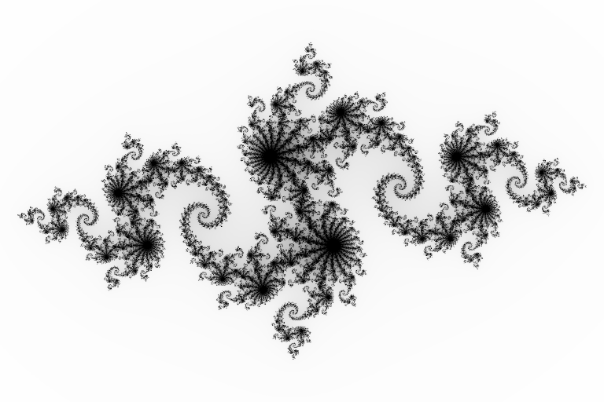
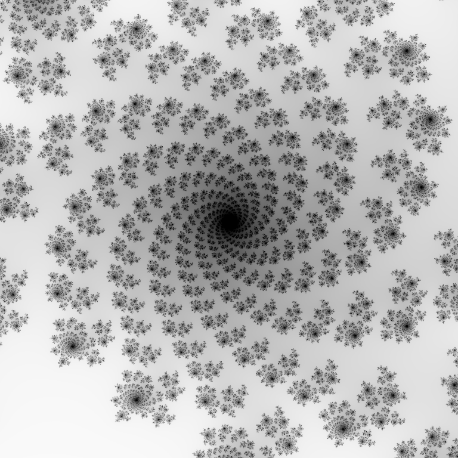

# Julia

A visualization of the Julia set of the map `z -> z^2 + c`, for different complex values `c`.

Compile with `make`, and run using `./julia [width [height]]`.
Requires `libsdl2`.

## Controls

| Key           |   Action                      |
|---------------|-------------------------------|
| `+`/`-`       | Zoom in/out from centre       |
| `0`           | Reset zoom                    |
| Arrow keys    | Move around                   |
| Left click    | Centre at clicked point       |
| `<`/`>`       | Perform fewer/more iterations |
| `[`/`]`       | Sample fewer/more points per pixel (for antialiasing) |
| Right click   | Set `c` as the clicked point  |
| `q`           | Quit                          |

